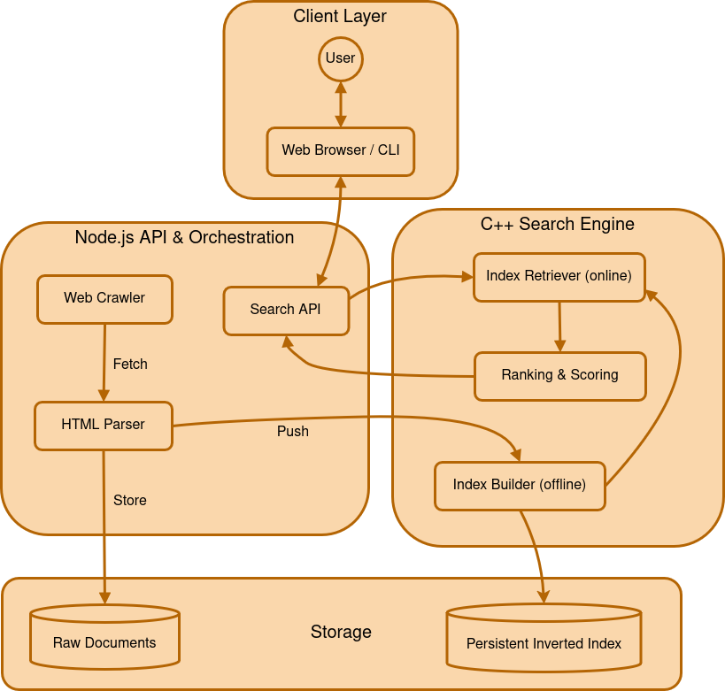
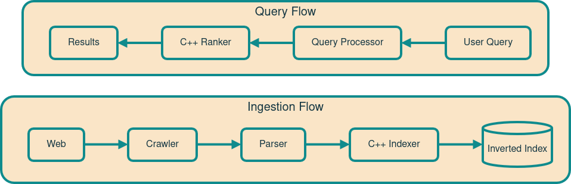
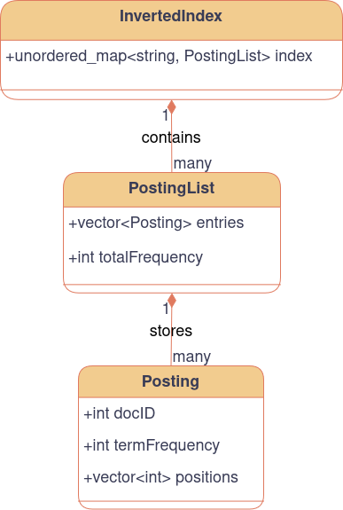
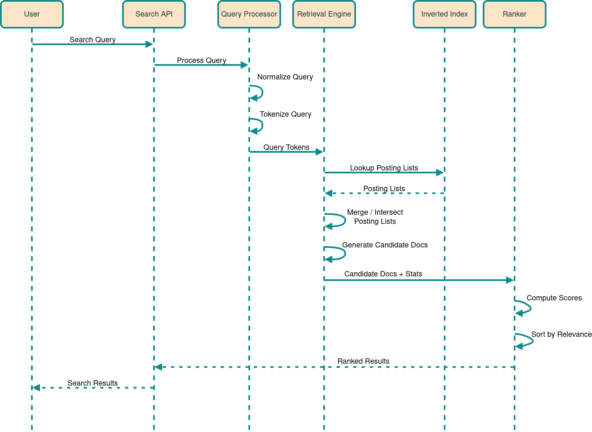
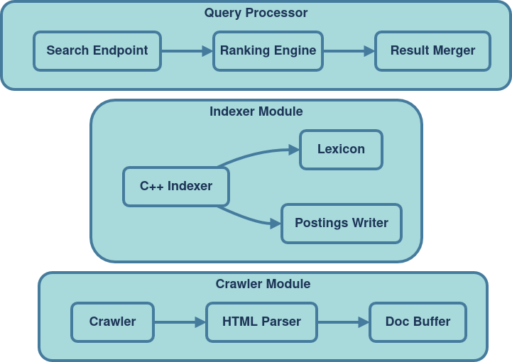

# SeptCrawler

This project is a search engine for retrieving learning resources (documentation, references, tutorials, and discussion forums). I'm writing the search engine's core from scratch in C++, with Node.js for the API, crawler & parser. The project is designed to crawl and index learning resources, allowing users to search across them through a focused interface without having them polluted by entertainment-related results.

> [!IMPORTANT]  
> **Project Status: In Active Design + Study/Research Phase; Development Soon To Start**  
> SeptCrawler is a personal learning, research, recreational, and portfolio project being developed independently by [me](#author).  
> Feedback and discussions are always welcome, but the repository is not intended for external contributions.

---

## Goal/Motivation

The goal of this project is for me to understand how traditional search engines work internally by building one from scratch.
It is intended to strengthen my backend engineering skills + my programming, researching, and system-designing skills as a whole.
I do not intend this to compete with existing search engines, as this is primarily for my learning of how such systems are designed and implemented.
Along the way, my goal is to make something that could be useful for learners and developers like myself searching for focused learning resources, while not having their flow-state disrupted.

---

## Technology Choices

The decision of using a combination of C++ and Node.js comes from the need to separate the system into performance-critical components and orchestration components.  
The search engine core (including indexing + retrieval + ranking) is to be implemented in C++ because these components rely heavily on efficient data structures, memory management, and low-level control.  
Node.js is used for the web-facing and coordination layer, including the crawler, HTML parser, and search API, where networking, asynchronous operations, and ecosystem support are more important than raw performance.  
This separation keeps the architecture modular while allowing each component to use technologies suited to its responsibilities.

---

## System Design

### <ins>High-Level Design</ins>

- **System Architecture Diagram:**  

- **Data Flow Diagram:**  

### <ins>Low-Level Design</ins>

- **C++ Indexing Internals (Data Structure Diagram):**  

- **Search Execution Sequence (Sequence Diagram):**  

- **Component Breakdown (Component Diagram):**  

---

## Author

&copy; 2026 [Saptaparno Chakraborty](https://github.com/schak04).  
All rights reserved.

---
