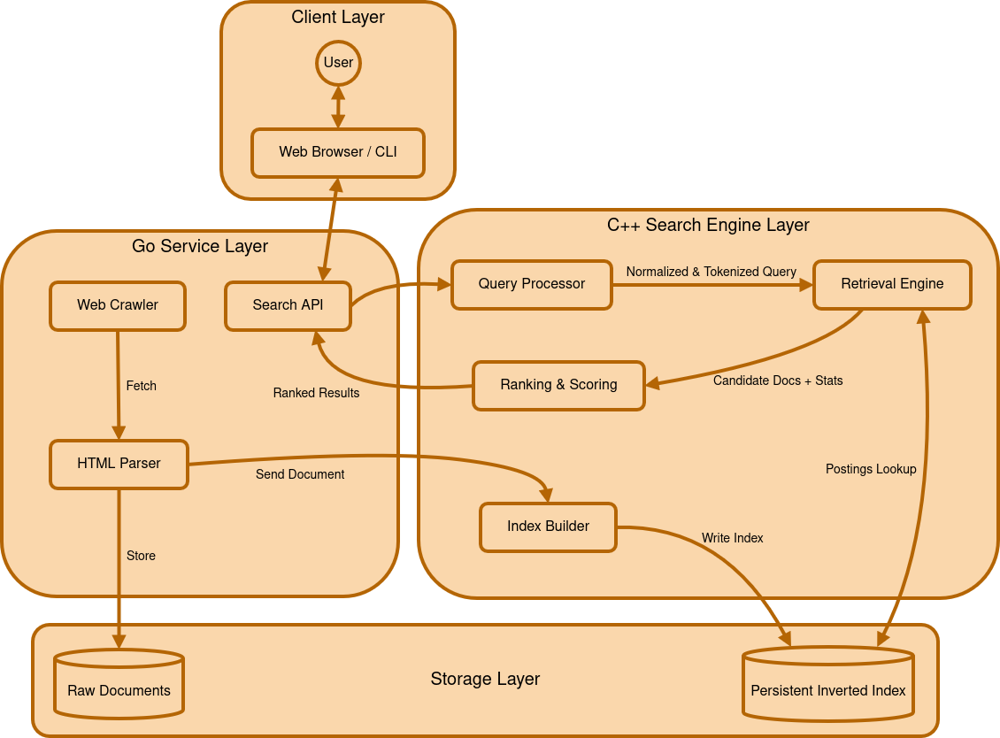
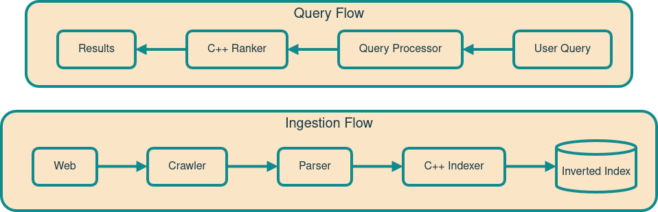
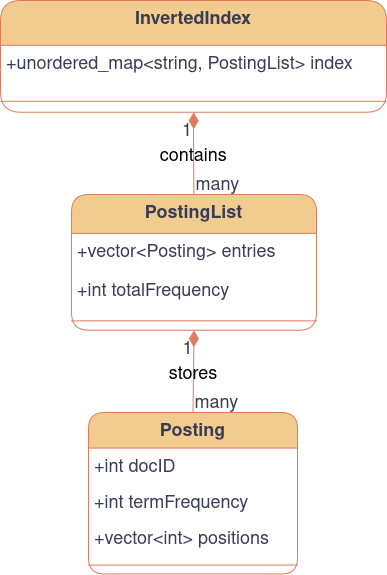
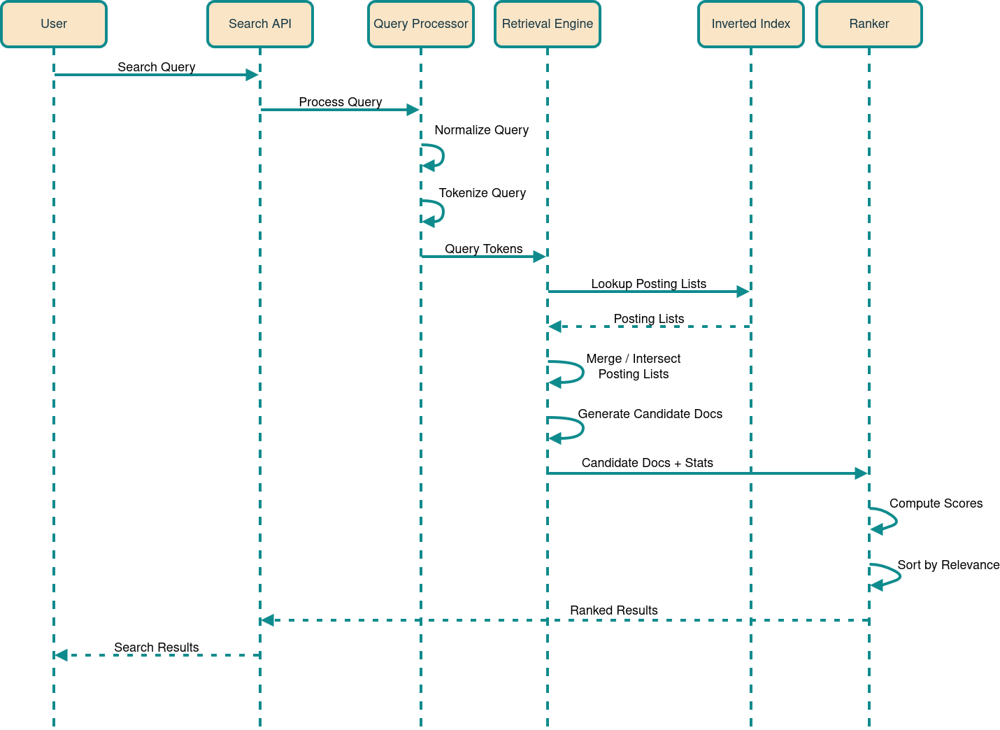
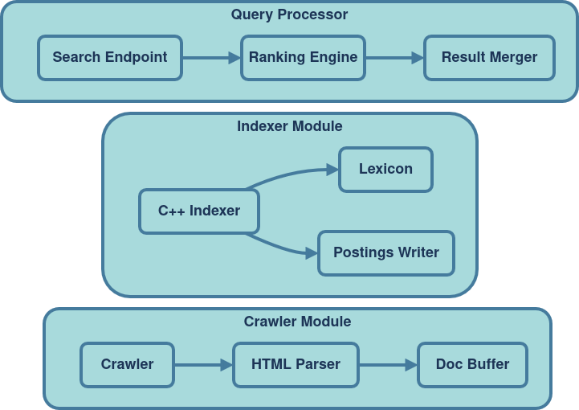

# SeptCrawler

This project is a search engine for retrieving learning resources (documentation, references, tutorials, and discussion forums). I'm writing the search engine's core from scratch in C++, and the service layer in Go. The system is designed to crawl and index learning resources, allowing users to search across them through a focused interface without having results polluted by entertainment-related content.

> [!IMPORTANT]  
> **Project Status: In Active Development Phase**  
> SeptCrawler is a personal learning, research, recreational, and portfolio project being developed independently by [me](#author).  
> Feedback and discussions are always welcome, but the repository is not intended for external contributions.

> [!NOTE]  
> Why "SeptCrawler"?  
> I named this project **SeptCrawler** because, first of all, Sept comes from my name, and second of all, the crawler is where everything begins.

---

## Goal/Motivation

The goal of this project is for me to understand how traditional search engines work internally by building one from scratch.
It is intended to strengthen my backend engineering, systems programming, and software design skills, along with my programming, research, and problem-solving abilities as a whole.
I do not intend this to compete with existing search engines, as this is primarily for my learning of how such systems are designed and implemented.
Along the way, my goal is to make something that could be useful for learners and developers like myself searching for focused learning resources, while not having their flow-state disrupted.

---

## Technology Choices

I chose C++ and Go to keep the search engine core separate from the backend service layer.

- **C++ Search Engine Core:** Index builder, query processor, retrieval engine, ranker, and data structures built from scratch in C++.
- **Go Service Layer:** Search API, web crawler, HTML parser, service coordination, network I/O, and client request routing in Go.
- **Go / C++ Integration:** C-compatible API wrapper with `extern "C"` and cgo for in-process communication between the Go service layer and C++ core.

---

## System Overview

There are two main pipelines:

1. **Ingestion Pipeline (offline):** Crawls and indexes learning resources from the internet.
2. **Query Pipeline (online):** Processes user queries and returns ranked results.

The system is split into 3 layers:

- **C++ Search Engine Core Layer:** Inverted index construction, query normalization/tokenization, candidate document retrieval, and ranking.
- **Go Service Layer:** Search API, web crawler, HTML parser, service coordination, network I/O, and client request routing.
- **Storage Layer:** Raw document storage and persistent inverted index storage.

---

## Design Decisions

1. **Separation of concerns:** Ingestion is separate from query processing, and retrieval is separate from ranking.
2. **Two independent pipelines:** Offline ingestion vs online query processing.
3. **Index is a database, not a pipeline stage:** It is queried, not passed through.
4. **Retrieval is the mandatory bridge:** Without retrieval, the ranker cannot operate and the index cannot be used meaningfully.
5. **In-process C-ABI boundary:** Go calls the C++ core through a thin C-compatible wrapper via cgo, keeping the architecture simple for v1 while isolating language runtimes.

> [!NOTE]  
> When I say **online**, I mean work performed while handling a live user request, and **offline** refers to work performed independently of any live user request, typically in the background to prepare data for future searches.

---

## System Design

### <ins>Textual Documentation</ins>

- [High-Level Design](./docs/design-details/hld.md)
- [Low-Level Design](./docs/design-details/lld.md)
- [C++ <-> Go Integration](./docs/design-details/cpp-go-integration.md)

### <ins>Diagrams</ins>

#### <ins>High-Level Design</ins>

- **System Architecture Diagram:**  
  

- **Data Flow Diagram:**  
  

#### <ins>Low-Level Design</ins>

- **C++ Indexing Internals (Data Structure Diagram):**  
  

- **Search Execution Sequence (Sequence Diagram):**  
  

- **Component Breakdown (Component Diagram):**  
  

---

## References

- https://bytebytego.com/guides/how-do-search-engines-work/
- https://www.geeksforgeeks.org/machine-learning/understanding-tf-idf-term-frequency-inverse-document-frequency
- https://cppreference.com/cpp/filesystem
- https://en.wikipedia.org/wiki/Inverted_index
- https://en.wikipedia.org/wiki/Tf%E2%80%93idf

---

## Author

&copy; 2026 [Saptaparno Chakraborty](https://github.com/schak04).  
All rights reserved.

---
